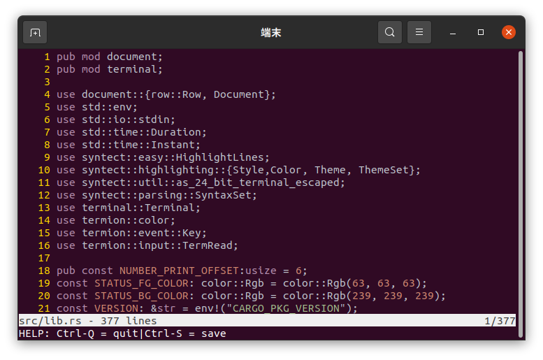

# うららエディタ



## シンプルなテキストエディタ

uraraedit はシンプルなテキストエディタです。  
[hetco](https://github.com/pflenker/hecto-tutorial)を fork して作られました。  
様々な言語のシンタックスハイライトに対応しています。  
名前の由来は[ハルウララ](https://ja.wikipedia.org/wiki/%E3%83%8F%E3%83%AB%E3%82%A6%E3%83%A9%E3%83%A9)という競走馬です。

## インストール

```
git clone https://github.com/0x6d61/uraraedit.git
cd uraraedit
cargo build --release
sudo cp target/release/uraraedit /usr/local/bin/urr
```

## ショートカット

| キー   | 役割                   |
| ------ | ---------------------- |
| Ctrl-S | 保存                   |
| Ctrl-q | 終了                   |
| Ctrl-a | 行頭へ移動             |
| Ctrl-e | 行末へ移動             |
| Ctrl-h | ファイルの先頭へ移動   |
| Ctrl-g | ファイルの一番下へ移動|
